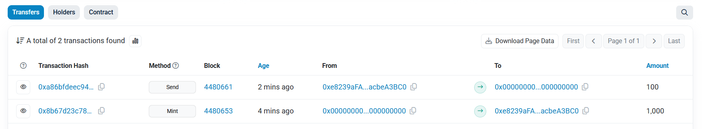
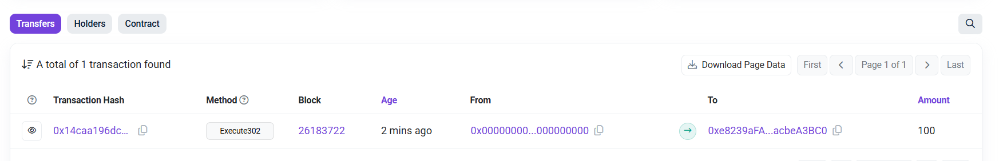

# LayerZeroToken

A LayerZeroToken(Omnichain Fungible Token (OFT)) implementation that enables seamless cross-chain token transfers between Holesky (Ethereum testnet) and Amoy (Polygon testnet).

## Overview

This project demonstrates how to deploy and operate a LayerZero OFT token that can transfer natively across multiple blockchains. The token maintains unified functionality and consistent supply across all supported networks.

## Features

- **Omnichain Token**: Native token functionality on multiple blockchains
- **Cross-Chain Transfers**: Seamless token transfers between Holesky and Amoy
- **Unified Supply**: Total token supply remains consistent across all chains
- **LayerZero Integration**: Uses LayerZero V2 for secure cross-chain messaging
- **Mintable**: Owner can mint tokens on the source chain

## Architecture

```
Holesky (Source) ↔ LayerZero Protocol ↔ Amoy (Destination)
     burns tokens        messages         mints tokens
```

## Project Structure

```
my-lz-oapp/
├── contracts/
│   └── LayerZeroToken.sol          # Main OFT contract
├── deploy/
│   └── LayerZeroToken.ts           # Deployment script
├── scripts/
│   ├── check-balance.ts            # Check token balances
│   ├── configure-peers.ts          # Set up cross-chain connections
│   ├── mint.ts                     # Mint tokens
│   ├── send.ts                     # Cross-chain transfer
│   └── set-both-enforced-options.ts # Configure execution options
├── .env                            # Environment variables
├── hardhat.config.ts               # Hardhat configuration
└── layerzero.config.ts             # LayerZero configuration
```

## Prerequisites

- Node.js >= 18.16.0
- npm or yarn
- MetaMask wallet
- Testnet tokens:
  - **Holesky ETH**: [Holesky Faucet](https://holesky-faucet.pk910.de/)
  - **Amoy POL**: [Polygon Faucet](https://faucet.polygon.technology/)

## Installation

1. Clone the repository:
```bash
git clone <repository-url>
cd my-lz-oapp
```

2. Install dependencies:
```bash
npm install
```

3. Create `.env` file:
```env
PRIVATE_KEY="0x[your_private_key]"
RPC_URL_AMOY="https://rpc-amoy.polygon.technology"
RPC_URL_HOLESKY="https://ethereum-holesky.publicnode.com"
```

## Deployment Guide

### Step 1: Deploy Contracts

Deploy to both networks:

```bash
# Deploy to Holesky
npx hardhat deploy --network holesky --tags LayerZeroToken

# Deploy to Amoy  
npx hardhat deploy --network amoy --tags LayerZeroToken
```

### Step 2: Configure Cross-Chain Connections

Set up peer relationships:

```bash
# Configure Holesky → Amoy connection
npx hardhat run scripts/configure-peers.ts --network holesky

# Configure Amoy → Holesky connection
npx hardhat run scripts/configure-peers.ts --network amoy
```

### Step 3: Set Enforced Options

Configure execution parameters:

```bash
# Set options on Holesky
npx hardhat run scripts/set-both-enforced-options.ts --network holesky

# Set options on Amoy
npx hardhat run scripts/set-both-enforced-options.ts --network amoy
```

### Step 4: Mint Initial Supply

Create tokens on the source chain:

```bash
npx hardhat run scripts/mint.ts --network holesky
```

### Step 5: Cross-Chain Transfer

Send tokens between chains:

```bash
npx hardhat run scripts/send.ts --network holesky
```

### Step 6: Verify Transfer

Check balances on both networks:

```bash
# Check Holesky balance
npx hardhat run scripts/check-balance.ts --network holesky

# Check Amoy balance  
npx hardhat run scripts/check-balance.ts --network amoy
```

## Transaction Screenshots

### Holesky Network Transactions
The following shows the mint and send transactions on Holesky:



- **Mint Transaction**: 1,000 LZT tokens minted to deployer
- **Send Transaction**: 100 LZT tokens sent cross-chain to Amoy

### Amoy Network Transaction
The corresponding receive transaction on Amoy:



- **Execute302 Transaction**: 100 LZT tokens received from Holesky

## Network Information

### Holesky (Ethereum Testnet)
- **Chain ID**: 17000
- **LayerZero EID**: 40217
- **Explorer**: https://holesky.etherscan.io/

### Amoy (Polygon Testnet)
- **Chain ID**: 80002  
- **LayerZero EID**: 40267
- **Explorer**: https://amoy.polygonscan.com/

## How It Works

1. **Token Burning**: When sending from Holesky, tokens are burned on the source chain
2. **Message Relay**: LayerZero relays the cross-chain message to Amoy
3. **Token Minting**: The Amoy contract mints equivalent tokens upon message receipt
4. **Supply Consistency**: Total supply across all chains remains constant

## Key Features

- **Gas Optimization**: Enforced options ensure efficient cross-chain execution
- **Security**: Peer verification prevents unauthorized cross-chain messages  
- **Flexibility**: Support for custom execution options and message composition
- **Transparency**: Full transaction tracking via LayerZero Scan

## Troubleshooting

### Common Issues

**"quoteSend failed with error 0x6592671c"**
- Missing enforced options configuration
- Run the enforced options setup scripts

**"No peer set for destination"**  
- Peer configuration not completed
- Run the peer configuration scripts

**"Insufficient balance for transfer"**
- Need to mint tokens first
- Run the mint script before attempting transfers

## Resources

- [LayerZero Documentation](https://docs.layerzero.network/)
- [LayerZero Scan](https://layerzeroscan.com/) - Transaction tracking
- [OpenZeppelin Contracts](https://docs.openzeppelin.com/contracts/)

## License

MIT License

## Contributing

1. Fork the repository
2. Create a feature branch
3. Commit your changes
4. Push to the branch
5. Create a Pull Request

---
